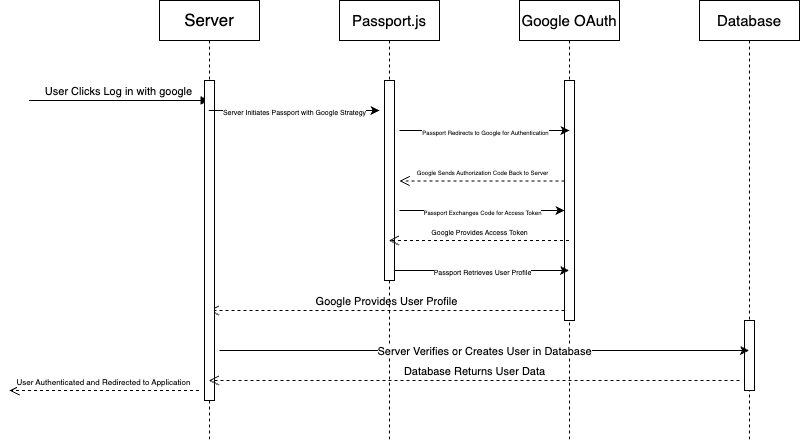

## Introduction:
Spencer Smith  
4 November 2024  
Lab 4  

## Executive Summary:

In this this lab I Created an API for my website along with Unit Tests.  The Unit test were created to be able to be used for different APIs.  I made the API using Node.js, MongoDB, and Postman.  

## Design Overview:

I started out this lab by writing the Unit tests. I began with wrriting ReadAll, Create, Delete, and Read functions.  After completing all of them I wrote the tests for them.  I wrote a total of 12 tests testing a mix of what should work and what shouldn't work.  
In the next part of the lab I made the backend of my API.  This included setting up a a MongoDb database, Google Auth certifications and the actual code in Node.js.  This involved a lot of troubleshooting and bug fixes. 

### Testing

### Postman POST

### UML

### File Descriptions

* api.js - Contains teh API functions
* api.test.js - This contains the 12 API tests along with the code to 
* index.js - This page contains the the code for the main setup of the API.  
* tasks.js - Contains the tasks for the API

## Questions:

#### Name and discuss at least two of the benefits of writing unit tests before writing code.
Imporoved Code Design: When you wirte your tests before your code you understand better the end goal of your code and what it needs to acomplish.  
Easier Debugging: When you write your tests before you can run them as you write your code.  This allows for debugging that takes place as you are writing your files.   
### What would be some of the benefits of automating your test scripts (i.e. so they run at each commit)?
A big benefit of automating test scripts is immediate feedback.  Every time that you commit your code you can know if it works or doesn't work.  This reduces your risk of adding bugs to your code.  You can know exactly when your bug appeared.  
### How long did this lab take you?
This lab took me longer than any other lab before.  I probably spent over 30 hours on this lab over the last two weeks.  I found it extremely difficult. 
### List three advantages to using a web API.
On of the first adavantages that I saw was a seperation of concerns.  Weh you have a front end and a back end you can have different teams working on both that use difffernet ways of doing things, but not worry becuase they are connected through the API.
Another advantage that I saw was that scalability.  When you us an API it is easy to scale up your front end and your back end.  Since the API connects everything else you just have to change one piece.  
The final advantage that I saw was integration and interoperability.  When you use an API you are able to have different pieces of code work together that may not even be written in the same language, but since they use the API they can connect. 
### What are the differences between these four HTTP methods: GET, POST, PUT, and DELETE? Which ones are idempotent?
The difference between the four methods are first, GET which retrives data, POST which sends data, PUT which updates data, and DELETE which deletes data.  POST is the only one that isn't idempotent becuase if you do it over and over the same thing won't happen.  

## Lessons Learned:
### Postman
One of the first problems that I had was when I tried to run Postman to run the HTTP methods.  I kept trying to run my commands but then it kept returning unauthorized.  I eventually found out that I needed to put the cookie into the cookie part.  This allowed my requests to be authorized and run correctly.  
### API tests
Another problem that I had was when I tried to write my API tests.  When I wrote them I incorrectly wrote my compare function to compare the values.  This in turn made all of my tests fail.  After some time searching for the bug I learned the correct way to compare the data and the tests ran correctly. 
### Google Certification
With my Google Certification I spent an hour incorrectly changing my code when I had not correctly entered the URLs correctly in the Google Auth Website.  I learned that whenever I am writing the instructions tin the Google Auth I need to make sure and double check that I am putting in the correct URL.  
## Conclusions :

- Set up Google Authentication
- Make an API
- Use Node.js in an API
- Use Postman to test API

## References

https://chatgpt.com/
https://mongoosejs.com/docs/guide.html#definition