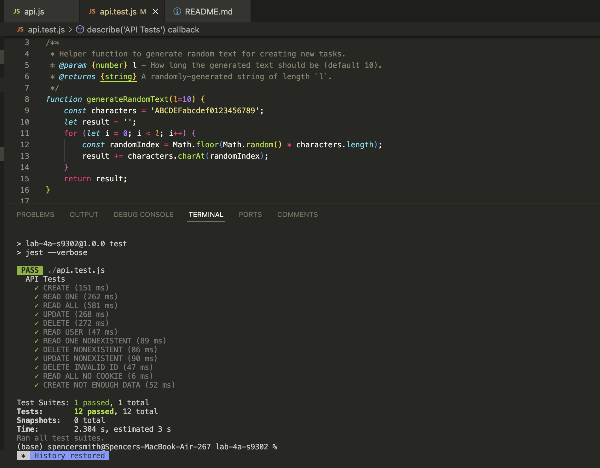
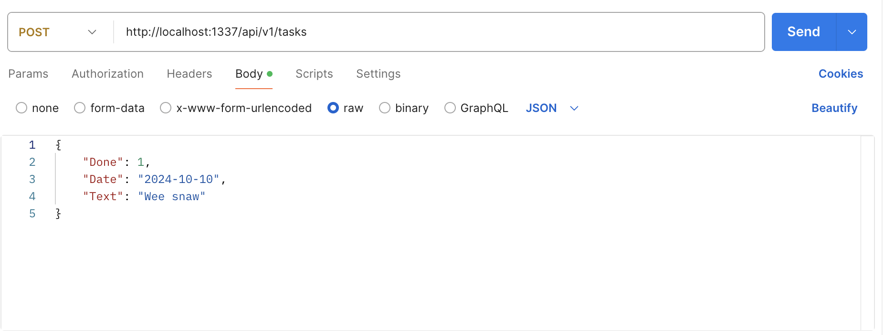

## Introduction:
Spencer Smith  
4 November 2024  
Lab 4  

## Executive Summary:

In this this lab I Created an API for my website along with Unit Tests.  The Unit test were created to be able to be used for different APIs.  I made the API using Node.js, MongoDB, and Postman.  

## Design Overview:

I started out this lab by writing the Unit tests. I began with wrriting ReadAll, Create, Delete, and Read functions.  After completing all of them I wrote the tests for them.  I wrote a total of 12 tests testing a mix of what should work and what shouldn't work.  
In the next part of the lab I made the backend of my API.  This included setting up a a MongoDb database, Google Auth certifications and the actual code in Node.js.  This involved a lot of troubleshooting and bug fixes. 

### My Webpage

### JSON request

### File Descriptions

* api.js - Contains teh API functions
* api.test.js - This contains the 12 API tests along with the code to 
* index.js - Contains the JavaScript for the webpage
* tasks.js - Contains the CSS styling for the webpage
* user.js - Is the the docker file the helps put it into a contatiner

## Questions:

### What is the purpose of using Docker containers?
The purpose of using Docker containers is so that we have a set apart speace where all of the code can run together.  The way a TA explained it to me was kind of like a VM that is a lot smaller and only has the purpose of running whats in the container
### Why is it useful to have both a development environment and a live server environment?
Becuase having two enviroments lets you edit or change one without effecting the other.  I can edit my development enviroment and if anything goes wrong it won't crash my live server.  
### What is the purpose of using a code versioning tool (i.e. Git)?
We use git because it allows for coders to ee back on changes that they have made, they can also make branches to test out progams on the code.  It allows for many people to work on code and upload it to one main branch.  
### What is the difference between a CSS rule with an element selector (i.e. h1,p,div etc.) and one with a class selector (i.e. .task, .task-done etc.)? When would you use each?
element selectors select all of the elements of that type for example h1 classes on the other hand effect everything that is marked to have the certain class. 
### What are the advantages of putting your styles in a separate .css stylesheet instead of in the <style> element of <head>?
This allows you to write CSS that can effect and change multiple pages.  You can have a uniform CSS page for your entire website instead of writeing the same code multiple times.  
### How do web browsers choose which CSS to use for an HTML element when the CSS rules contradict each other? What is the order of precedence for CSS rules?
It is whatever was last said basically.  if you link two css sheets it will be the one thats put last that will take presidence.  
### Why should you disable directory access for your server?
This helps to keep information secure.  people can't access information in the directory that could be sensitive.  

## Lessons Learned:
### Docker Problem
One of the problems that I had while doing this lab was setting up docker.  Docker is a complicated program that requires experience to work properly.  When I started this project I couldn't get Docker set up.  I spent a couple of hours on it, I eventually ended up going to one of the TAs to help me with my problem.  It ended up being that I hadn't set up the docker file correctly.  

### Margins and Formatting
Another problem that I had was getting the formatting and margins correct in the webpage.  I was trying to get the webpage to look good on a mobile screen.  I couldn't get the webpage to format correctly.  It was happening becuase I was trying to format using specific measurements instead of relative measurments that could change around depending on the size of the screen.  The solution was changing all of my measurments to be dynamic for individual screens.  

### Favicon
Favicons are small images that are on the corner of the webpage tab.  I couldn't get my favicon to load.  This was due to the fact that I hadn't done a hard refresh.  I finally figured how to due so and once I did it the favicon loaded.  
## Conclusions :

- Put Favicons on webpages
- Use CSS in all three ways of linking to HTML
- Create and use Javascript
- Create and input data into an HTML file

## References

https://www.w3schools.com/html/default.asp
https://csszengarden.com/