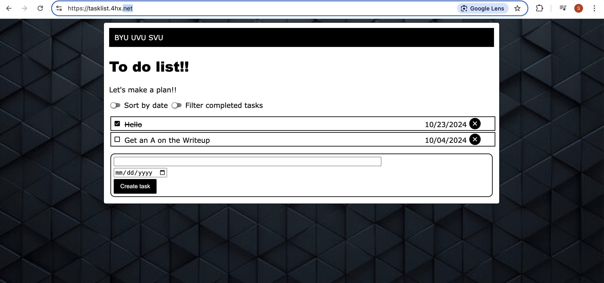

## Introduction:
Spencer Smith  
1 October 2024  
Lab 2  

## Executive Summary:

In this this lab I Expanded on the Javascript on my webpage giving it full functionality.  This included allowing users to add delete and mark complete on the tasks on the webpage. I got a encryption certicfication for my website and made a backup bash function for the webiste if something goes wrong.   

## Design Overview:

I started by makeing the backbone JavaScript for my page which sorted information into the internal storage on a browser.  I then Made the CRUD functions which allowed users to add delte and mark complete to all of their tasks.  I also made the tasks store in local storage so they can go back to the page and the tasks will still be there.  

After this I added a security certification to my website which now gives it the https protocol. I gave the site a redirect to tasklist.4hx.net so now I actually have a domain.  After this I made a Bashscript which if run would create a second website with the same code.  This will act as a failsafe if anything goes wrong with the original page.  

### UML

### My Webpage With CRUD Functions

### My Webpage With HTTPS

### File Descriptions

* index.html - Contains the basic HTML formatting for the page
* favicon.ico - This contains a favicon image of Jennifer Lawrence
* script.js - Contains the JavaScript for the webpage
* style.css - Contains the CSS styling for the webpage
* docker-compose.yml - Is the the docker file the helps put it into a contatiner

## Questions:

### What are two differences and similarities between JavaScript and a previous language you have used (e.g. C++ or Python)? (Think of differences and similarities that are more unique to these 2 languages, not all languages in general.)
Both python and JavaScript are High level languages, this means that both of them don't need to be compiled. Both of them are dynamically typed meaning the variables are determined at runtime.  Two differences between them is first the syntax Python is determined by indentation while JavaScript is lie C++ with the curly braces.  Another difference is where they are executed.  JavaScript is run on Web browsers while Python is run on on servers or terminals.  

### What is the difference between JSON and JavaScript objects?
The first differnce is the syntax and formatting.  They are both formatted very differently.  JSON objects can also only be stored as strings.  JavaScript objects can eb strings intgersa and booleans.

### If you open your web page in two different browsers, will changes on one appear on the other? Why or why not?
No they will not appear.  this is due to the fact that the tasks are stored in lcoal storage on the browser.  

### How long did you spend on this lab?
I spent about 10 hours working on lab 2.  

### What is the difference between http and https?
HTTP is not encrypted and unsecure while HTTPS is.  

### What does the A record do in your DNS domain?
The A record is used to map a domain name to an IPv4 address.

### Which key does the certbot tool send to Let's Encrypt to be embedded in the certificate; the public key or the private key?
The public key.

### What is the TTL setting in DNS, what are the units, and what does it do?
The TTL specifies how long a DNS resolver should cache a particular DNS record before it needs to query the authoritative DNS server for updated information. The TTL value is measured in seconds.

### The DNS registrar tool is new this year. What did you like about it? What could we do to improve it? (Any answer gets full credit.)
I really liked the DNS tool and the ability to chooose my own domain names. 

### How would you incorporate bash scripts in your future?
I will use Bash scripts in the future to write programs and do things that I have to do repeatedly as to quicken the proccess.  

## Lessons Learned:
### How DNS servers work
 The problem that I had was with tht DNS server was trying to get my CNAME record to work.  It was not redirecting to my original website.  This happened becuase I had redierected to the IP address adn not the website.  I changed the redierct to my orginal website.  

### CRUD Update
I had another problem with creating the CRUD create function. I wasn't updateing the local storage and it caused the prgram not to createt eh new function on the screen.  I fixed the change by adding in a code snippet  which updated the local storage.  

### UML Diagram
The problem that I had with the UML diagram was with the depth of analysis.  I made the UML diagram and then went to the TA and he said that I hadn't put int he required detail about all of the funcions and put in the options for the different tasks.  I had to redo the entire UML diagram and add in all of the missing information. 

## Lessons Learned :

- JavaScript Functionality
- Get HTTPS certificate
- Use DNS servers to provide Websites with domain names
- Create BashScripts

## References

https://www.w3schools.com/js/DEFAULT.asp

https://www.cloudflare.com/learning/ssl/what-is-an-ssl-certificate/