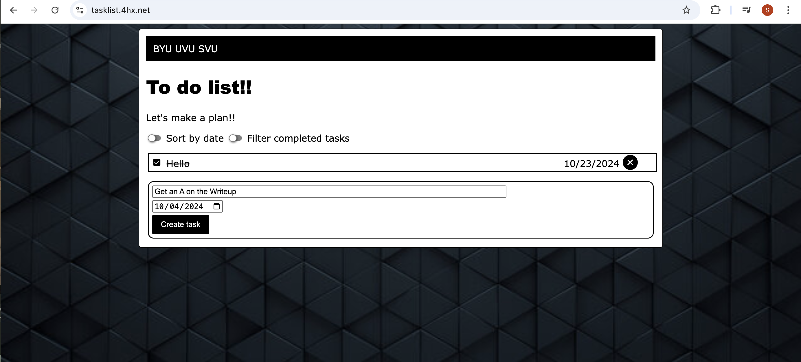

## Introduction:
Spencer Smith  
1 October 2024  
Lab 2  

## Executive Summary:

In this this lab I Expanded on the Javascript on my webpage giving it full functionality.  This included allowing users to add delete and mark complete on the tasks on the webpage. I got a encryption certicfication for my website and made a backup bash function for the webiste if something goes wrong.   

## Design Overview:

I started by makeing the backbone JavaScript for my page which sorted information into the internal storage on a browser.  I then Made the CRUD functions which allowed users to add delte and mark complete to all of their tasks.  I also made the tasks store in local storage so they can go back to the page and the tasks will still be there.  

After this I added a security certification to my website which now gives it the https protocol. I gave the site a redirect to tasklist.4hx.net so now I actually have a domain.  After this I made a Bashscript which if run would create a second website with the same code.  This will act as a failsafe if anything goes wrong with the original page.  

### UML

### My Webpage With CRUD Functions

### My Webpage With HTTPS

### File Descriptions

* index.html - Contains the basic HTML formatting for the page
* favicon.ico - This contains a favicon image of Jennifer Lawrence
* script.js - Contains the JavaScript for the webpage
* style.css - Contains the CSS styling for the webpage
* docker-compose.yml - Is the the docker file the helps put it into a contatiner

## Questions:

### What are two differences and similarities between JavaScript and a previous language you have used (e.g. C++ or Python)? (Think of differences and similarities that are more unique to these 2 languages, not all languages in general.)

### What is the difference between JSON and JavaScript objects?

### If you open your web page in two different browsers, will changes on one appear on the other? Why or why not?

### How long did you spend on this lab?

### What is the difference between http and https?

### What does the A record do in your DNS domain?

### Which key does the certbot tool send to Let's Encrypt to be embedded in the certificate; the public key or the private key?

### What is the TTL setting in DNS, what are the units, and what does it do?

### The DNS registrar tool is new this year. What did you like about it? What could we do to improve it? (Any answer gets full credit.)

### How would you incorporate bash scripts in your future?

## Lessons Learned:
### Docker Problem
One of the problems that I had while doing this lab was setting up docker.  Docker is a complicated program that requires experience to work properly.  When I started this project I couldn't get Docker set up.  I spent a couple of hours on it, I eventually ended up going to one of the TAs to help me with my problem.  It ended up being that I hadn't set up the docker file correctly.  

### Margins and Formatting
Another problem that I had was getting the formatting and margins correct in the webpage.  I was trying to get the webpage to look good on a mobile screen.  I couldn't get the webpage to format correctly.  It was happening becuase I was trying to format using specific measurements instead of relative measurments that could change around depending on the size of the screen.  The solution was changing all of my measurments to be dynamic for individual screens.  

### Favicon
Favicons are small images that are on the corner of the webpage tab.  I couldn't get my favicon to load.  This was due to the fact that I hadn't done a hard refresh.  I finally figured how to due so and once I did it the favicon loaded.  
## Conclusions :

- Put Favicons on webpages
- Use CSS in all three ways of linking to HTML
- Create and use Javascript
- Create and input data into an HTML file

## References

https://www.w3schools.com/html/default.asp
https://csszengarden.com/